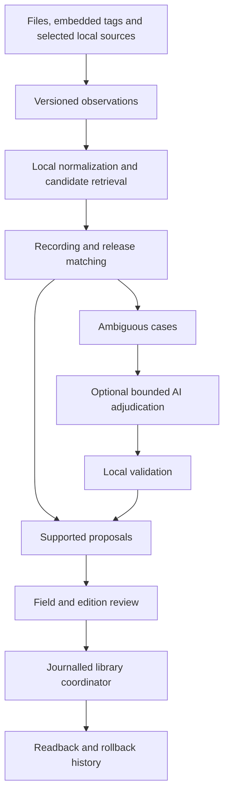

# Library cleanup and metadata enrichment research

> Implementation follow-up (10 September 2026): the core correctness, local-observation/import,
> bounded album-edition review, existing-provider enrichment/caching and closed-candidate text AI
> work is implemented. The findings below describe the researched baseline and rationale. The
> current behavior and limits are maintained in [Assistant architecture](ASSISTANT_ARCHITECTURE.md)
> and the [operator guide](../ASSISTANT.md). Additional paid/source pilots and specialist OCR/audio
> experiments remain conditional on coverage measurements; no private-library accuracy is claimed.
> The current [ordered backlog](../TODO.md#library-metadata-ordered-implementation-plan) prioritizes
> albums and game/film soundtracks. Compilation safeguards and informative collision suffixes
> are implemented; the [offline pilot tooling](LIBRARY_METADATA_PILOT.md) is ready for independent labels.

## Findings and recommendation

The next substantial improvement should be a better evidence and matching pipeline, followed by a bounded AI review stage. Adding more catalogs to the current single-track matcher would improve coverage in some cases, but it would also expose weaknesses in multilingual comparison, candidate retrieval, release selection, and conflict presentation.

The recommended sequence is:

1. Correct the known retrieval and ambiguity problems and retain competing proposals.
2. Extract existing identifiers, richer embedded tags, and trusted local sidecar information.
3. Resolve recording identity separately from album edition and track position, using album-wide evidence where available.
4. Expand MusicBrainz enrichment and add selected external sources according to measured gaps.
5. Test AI on the remaining ambiguous cases, requiring a choice among supplied candidates or an explicit abstention.

The research below records the design recommendation and the historical implementation baseline `f935177`, inspected on 10 September 2026; the follow-up note above links to the implemented contract. Source documentation was checked on that date. No private-library benchmark, paid recognition request, or live AI comparison was performed; expected improvements below are hypotheses to measure, not claimed accuracy gains.

## 1. What the current implementation does

The product already has the right write boundary: local detection produces proposals; review selects operations; the library coordinator journals and executes them. Catalog metadata starts unchecked. The new filename collision behavior proposes numeric suffixes without changing embedded titles. These foundations should remain.

The principal implementation owners are:

| Area | Current owner and behavior |
|---|---|
| Local cleanup | [`cleanup.rs`](../crates/music-domain/src/cleanup.rs), especially `cleanup_loose_key`, `build_context`, `plan_track`, and `analyze_cleanup`: filename rules, sibling evidence, missing tags, folder proposals, name reservations. |
| Catalog retrieval | [`cleanup_enrichment.rs`](../crates/music-server/src/cleanup_enrichment.rs): MusicBrainz search/detail requests, local `fpcalc`, AcoustID and Last.fm adapters, bounded response parsing. |
| Matching and proposals | [`workflow.rs`](../crates/music-application/src/cleanup_enrichment/workflow.rs): score thresholds, fingerprint fallback, release selection, metadata differences, vocabulary mapping and cache reuse. |
| Available observations | [`catalog.rs`](../crates/music-application/src/cleanup_enrichment/catalog.rs): small typed recording/release models; richer provider fields are not carried through automatically. |
| Embedded metadata | [`metadata.rs`](../crates/music-media/src/metadata.rs): Lofty and format-specific adapters; title, artist, album artist, album, numbers, year, genre, BPM and artwork. |
| Review presentation | [`CleanupDialog.tsx`](../frontend/src/components/CleanupDialog.tsx), especially `mergeEnrichment`: combines local and catalog operations. |
| Cache identity | [`cleanup_enrichment.rs`](../crates/music-application/src/cleanup_enrichment.rs): exact metadata/path/file signature plus policy identity; source revisions invalidate evidence. |

### Confirmed implementation gaps

These findings follow directly from the code; their prevalence in the actual collection is unmeasured.

| Finding | Concrete behavior and consequence | Priority |
|---|---|---|
| Retrieval is narrower than matching | `search_metadata` requires title and artist, adds exactly one `qdur` bucket, and retrieves five results. MusicBrainz defines `qdur` as duration in milliseconds divided by 2,000. Files at 179,999 and 180,001 ms fall into different buckets despite differing by 2 ms; the later ten-second tolerance cannot recover an excluded candidate. [1](https://musicbrainz.org/doc/MusicBrainz_API/Search) | High |
| Non-Latin comparison is destructive | `cleanup_loose_key` retains ASCII letters and digits after decomposition. Pure Japanese or Cyrillic names can become empty; different non-Latin names containing the same numeral can collapse to the same key. Empty keys abstain, but surviving common digits can create false equivalence. | High |
| Edition choice is arbitrary among eligible matches | `choose_release` chooses the first eligible same-title release. A recording can appear on several editions. `canonical_metadata` then takes that edition's date, album and positions; otherwise it falls back to the recording's first-release date for the same `year` field. | High |
| Release evidence is incomplete | The connector relies on releases included in a recording lookup and does not browse subsequent pages. MusicBrainz documents a limit of 25 linked entities and separate browse pagination. The local `MAX_RELEASES = 100` does not expand what the server returned. [2](https://musicbrainz.org/doc/MusicBrainz_API) | High |
| Repeated recording occurrences are collapsed | `parse_release_detail` stops at the first matching recording occurrence. A recording appearing twice on a release or across discs needs a release-track identity, not only a recording ID. | High |
| Acoustic ambiguity is filtered before it is assessed | `select_acoustic_candidate` discards entries with multiple recording IDs before calculating the margin. A strong ambiguous entry can disappear, leaving a weaker single-ID entry apparently unopposed. Conversely, two entries for the same recording can compete with each other and prevent acceptance. | High |
| Useful provider fields are discarded | Recording requests include genres, tags and release groups, but the typed `Recording` and parser keep only title, artist, first-release date and basic release summaries. There is no cleanup proposal for MusicBrainz genre evidence. | Medium |
| Local identifiers and secondary tags are unavailable to cleanup | `AudioMetadata` has no MBIDs, ISRCs, barcode, catalog number or full dates. The general Lofty read path chooses a primary tag, otherwise the first tag; it does not gather field-level alternatives from every tag block. This is an extraction limitation, not evidence that existing files lack these values. | High |
| Competing field proposals disappear in the UI | `mergeEnrichment` removes local tag operations for fields that have catalog operations. Catalog proposals remain unchecked, but the operator cannot compare both alternatives in that merged review. Results with no metadata operations are skipped by this merge, including their notes. | Medium |
| A score is presented as probability | The workflow describes a weighted metadata score or AcoustID score as a percentage of “confidence.” Neither is calibrated against this library's correctness labels. | Medium |

The current cache has an explicit `force` option and invalidates on the source signature/revision; it is not permanently unrecoverable. It does, however, lack age-based expiry in this lookup path, and an unmatched result can be reused until forced or invalidated. Future source expansion should preserve the existing stale-write checks while distinguishing a genuine negative result, an ambiguous result, and a temporary provider failure.

Small diagnostic cases make the first implementation phase concrete. These are deductions from the inspected functions, not results from a live-provider experiment:

| Input case | Current consequence | Required regression expectation |
|---|---|---|
| Local duration 179,999 ms; correct catalog recording 180,001 ms | Exact `qdur` search uses different buckets. | Retrieval spans the boundary; final ranking still checks duration. |
| Names `東京2` and `大阪2` | Both loose comparison keys become `2`. | Preserve distinguishing Unicode characters. |
| Acoustic result A: score 0.99 with two recording IDs; result B: 0.87 with one ID | A is discarded; B can pass score and margin checks. | Retain the strong ambiguous evidence and abstain or resolve it explicitly. |
| Two acoustic results for one recording, scored 0.95 and 0.94 | A margin of 0.01 blocks an otherwise potentially supported identity. | Aggregate by recording while retaining ambiguity from multi-ID observations. |
| Same recording occurs at disc 1/track 3 and disc 2/track 8 | Parser returns the first occurrence. | Preserve both release-track candidates until position evidence resolves them. |

## 2. Separate the questions being answered

“What is this song?” hides several different problems. A filename collision only concerns a filesystem destination. Audio identity concerns a recording; an album date concerns a release; a composer usually concerns a musical work; “ominous forest encounter” concerns intended use.

MusicBrainz explicitly separates recordings, releases, release groups and works. Its release model includes edition information such as date, country, label and medium. Picard also maps identifiers and credits into distinct tag fields. These distinctions provide a sound reference for the product's model. [3](https://musicbrainz.org/doc/Release) [4](https://picard-docs.musicbrainz.org/en/latest/appendices/tag_mapping.html)

| Question | Strong evidence | Appropriate output |
|---|---|---|
| Are these files byte-identical? | Full file hash and size | Exact-file duplicate group |
| Do they contain the same recording? | Audio fingerprint, corroborating duration and metadata | Recording relationship, retaining every file |
| Which edition supplied this track? | Release ID, barcode, catalog number, complete track list and medium evidence | Edition and release-track selection |
| Which written work is performed? | Work relationships and credited source | Composer/work/movement metadata |
| What does the audio sound like? | Local measurements and evaluated classifiers | Derived acoustic descriptors |
| How could it be used in a session? | Audio context and operator vocabulary | Reviewable mood/use tags |

One recording can legitimately have several files, encodings and release associations. A composition can have many recordings. Neither matching titles nor an acoustic resemblance authorizes deletion or inheritance of a particular edition's metadata.

## 3. Algorithmic improvements

### 3.1 Preserve evidence before normalizing it

Create an observation layer alongside the existing playable-track projection. Each observed field should retain its raw value, normalized comparison value, source, source entity, scope, and extraction version. This avoids squeezing a detailed tag inventory into one artist string and one year too early.

Read compatible tag blocks independently and resolve them per field. For example, a useful title in a secondary tag can fill a missing primary title, while two conflicting artists should produce alternatives. Preserve unknown frames during writes and test the exact supported formats. Picard's published mappings are a useful interoperability checklist for recording/release IDs, ISRC, original date, album artists, composer and other credits. [4](https://picard-docs.musicbrainz.org/en/latest/appendices/tag_mapping.html)

Physical tag names need explicit mappings: Vorbis `MUSICBRAINZ_TRACKID` identifies a recording, while `MUSICBRAINZ_RELEASETRACKID` identifies a release-track slot and `MUSICBRAINZ_ALBUMID` a release. Avoid inferring entity type from a generic field name containing “track.” [4](https://picard-docs.musicbrainz.org/en/latest/appendices/tag_mapping.html)

Use separate representations for display, comparison and filenames:

- Preserve authored display spelling and original script.
- Normalize canonical Unicode equivalence, whitespace and carefully selected punctuation for comparison. Unicode normalization is standardized; ASCII-only transliteration is a separate, lossy operation. [5](https://www.unicode.org/reports/tr15/)
- Keep aliases and transliterations as additional search forms. Do not merge artists merely because transliterations agree.
- Parse version descriptors such as live, acoustic, instrumental, remix, remaster, radio edit and extended mix into evidence-bearing tokens. Remove only recognized delivery junk.
- Treat suspected encoding corruption as a reversible proposal. `ftfy` is a useful algorithm/reference corpus for avoiding changes to already-correct text, not a reason to add a Python runtime to this Rust backend. [6](https://ftfy.readthedocs.io/en/latest/index.html)

A title such as `01 - Artist - Song (Live at Venue) [320kbps]` should yield several observations: track number, possible artist, base title, live/version descriptor, and encoding junk. The live descriptor must survive matching even when the review proposes a shorter filename.

### 3.2 Use the folder as context, with mixed-folder detection

The selection-independent sibling fix is valuable, but a directory should be treated as a possible album, not assumed to be one. Estimate whether siblings form a coherent release from album/album-artist agreement, numbering coverage, disc layout, identifiers, date/label consistency and the proportion of missing fields.

For a coherent album, use the strongest tagged siblings to retrieve release candidates and recover missing track fields. For a compilation, prefer album artist and per-track artists over majority artist propagation. For a download folder or collection of unrelated cues, use per-track matching and offer grouping suggestions separately.

A useful improvement is leave-one-out evidence: when validating a track's current tag, do not let that same value supply its own corroboration. Distinguish genuinely independent sibling observations from many files carrying the same previously generated guess. The existing low/high confidence labels can remain in the UI while the underlying evidence becomes more precise.

### 3.3 Broaden retrieval without weakening acceptance

Candidate retrieval and acceptance should have different objectives. Retrieval should find plausible alternatives; acceptance should reject contradictions.

Recommended bounded retrieval order:

1. Look up valid embedded recording/release identifiers.
2. Search ISRC, retaining all resulting recording candidates.
3. Search reliable artist/title observations with a duration range or neighboring quantized buckets.
4. Try supported aliases, punctuation variants and parsed filename hypotheses, recording which query found each candidate.
5. Search an album or release cluster if enough sibling evidence exists.
6. Use fingerprint recognition for missing, contradictory or unresolved identity evidence.

MusicBrainz supports recording searches by ISRC, duration, release and other structured fields. Its permanent MBIDs identify specific entity types; an ISRC is intended to identify a recording, not an album edition. [1](https://musicbrainz.org/doc/MusicBrainz_API/Search) [7](https://musicbrainz.org/doc/MusicBrainz_Identifier) [8](https://isrc.ifpi.org/why-use-isrc/when-to-assign)

Use bounded query expansion, merge results by provider entity ID, and retain retrieval provenance. Start by testing a modest candidate budget such as 20 distinct recordings, expanding only when unresolved; that is an engineering starting point, not an empirically optimal limit. Missing duration should remain missing evidence rather than become a forced zero-duration search.

Text-search errors and empty results should have distinct outcomes. The current early return on a MusicBrainz search error prevents fingerprint fallback. A source-aware orchestrator could still obtain and cache recognition evidence, but it must not claim canonical MusicBrainz metadata is available during a MusicBrainz outage.

### 3.4 Score evidence per field and per identity level

Keep an interpretable matcher as the baseline. Useful features include title token agreement, artist ID/alias agreement, duration difference, version compatibility, album evidence, identifier agreement and local folder consistency. Provider search scores are retrieval features, not probabilities.

Beets provides an established example of weighted metadata distances, recommendation margins and limits on recommendation strength when fields are missing or unmatched. This supports using explicit penalties and uncertainty categories instead of a single “looks close” number. Its defaults should not be copied as calibrated values for this collection. [9](https://beets.readthedocs.io/en/stable/reference/config.html#autotagger-matching-options)

Suggested decision states are **supported**, **needs review**, **conflicting evidence**, and **unresolved**. A trusted local identifier disagreeing with the fingerprint should produce a conflict. A likely typo can be reviewable without becoming accepted identity. Live/studio, instrumental/vocal and incompatible duration evidence should block automatic promotion even when titles are similar.

Initially use transparent rules; later compare logistic regression or a small tree model trained on reviewed feature vectors. Calibrate on held-out examples and report performance by script, genre, source and collection type. Do not require an LLM for every pairwise comparison.

### 3.5 Match albums collectively

For a probable album, build a cost matrix between local files and candidate release-track slots. Solve a minimum-cost assignment, allowing explicit unmatched files and missing tracks. The standard linear assignment problem supports rectangular matrices; dummy unmatched slots let the application avoid forcing a bad match. SciPy documents this algorithmic family, but production ownership can remain in Rust. [10](https://docs.scipy.org/doc/scipy/reference/generated/scipy.optimize.linear_sum_assignment.html)

The assignment target must be a release-track slot, including medium and position, not merely a recording ID. Two slots can refer to the same recording. Compare releases using the full assignment cost, unmatched penalties and edition clues; do not pick a release by response order.

Use original release date and edition release date as separate observations. If the current public contract retains only `year`, offer a documented operator policy and show the chosen source date. Avoid silently changing the meaning of that field. Barcode, catalog number and an embedded release ID should usually distinguish editions more strongly than a preferred country or “earliest year” preference.

This is likely the largest quality improvement for complete soundtracks and albums. For isolated tracks with no edition evidence, accepting recording-level title/artist while leaving album/date/position unresolved is a correct result.

### 3.6 Improve duplicate and naming analysis separately

Keep the existing numeric suffix as a final fallback. Before it, offer meaningful disambiguators when supported: artist, version, disc/track position, or edition. Preview all selected targets together, including folder moves, and apply filesystem-specific length and character rules after adding the suffix.

Duplicate analysis should progress from cheap to expensive: same size plus full-file hash; then candidate grouping by duration and identity; then acoustic comparison. A decoded-audio hash can identify matching decoded samples across different tag containers, but lossy re-encodes will generally not be sample-identical. A normalized acoustic comparison can generate candidate duplicates without establishing exact equivalence.

Chromaprint is explicitly designed for near-identical audio rather than general musical similarity. It is appropriate for full-file identity and candidate duplicate detection, but not a proof that two different performances are interchangeable. [11](https://github.com/acoustid/chromaprint)

Retain every file until an explicit duplicate decision. Show codec, bitrate/sample format, duration, clipping/decoding problems, artwork and tag differences. “Keep the highest bitrate” is not enough: a larger lossy transcode may be worse than the original.

## 4. Metadata available without another catalog

The cheapest additional evidence may already be next to or inside the files.

| Evidence | Potential use | Required boundary |
|---|---|---|
| Embedded MBIDs, ISRC, AcoustID ID, barcode, catalog number | Exact candidate retrieval and edition resolution | Validate format and entity type; corroborate stale or copied identifiers. |
| Secondary tag blocks and repeated values | Recover missing fields, preserve artist lists and credits | Per-field alternatives; no wholesale replacement of one block with another. |
| CUE sheets and trusted track-list exports | Disc/track boundaries, titles, performers and positions | Parse as data; match to actual local files; do not execute content or split audio implicitly. |
| Purchase/download manifests and creator-provided metadata | Original title, creator, album, source URL and license | Explicit import with provenance; receipts may contain private data. |
| Booklets and cover images | Credits, catalog numbers, track lists, dates | Local OCR first; retain page/region and require review. Artwork does not prove the edition alone. |
| Existing accepted library records | Consistent spelling and missing-field recovery | Require identity evidence; avoid propagating historical mistakes. |
| Local audio analysis | Duration, tempo estimate, key candidates, vocal/instrumental and timbral cues | Derived observations stay separate from authoritative catalog credits. |

For ambient tracks and custom campaign music, source manifests and descriptive audio analysis may be more useful than mainstream music databases. Empty identity results should not force an unrelated commercial recording onto these files.

## 5. External resources

The ratings below are engineering judgments about fit, not measured coverage rankings. A connector must expose separately whether its data can be displayed, cached, exported into tags, or sent to an AI service.

| Resource | Useful information | Access and limitations | Recommendation |
|---|---|---|---|
| **MusicBrainz** | Recording/release identity, artist credits, track lists, dates, relationships, genres and aliases | Noncommercial API use is free without a key; meaningful User-Agent and generally one request/second per IP. Core data is CC0; supplementary data has different terms. [2](https://musicbrainz.org/doc/MusicBrainz_API) [12](https://musicbrainz.org/doc/MusicBrainz_API/Rate_Limiting) [13](https://musicbrainz.org/doc/About/Data_License) | Primary canonical catalog; improve its use before adding breadth. |
| **AcoustID + Chromaprint** | Recording candidates from audio, even with bad text tags | Application key; local fingerprint plus whole-file duration; free service is noncommercial and capped at three requests/second. A result may map to multiple recordings. [14](https://acoustid.org/webservice) | Keep and improve ambiguity handling and fingerprint reuse. |
| **Last.fm** | Community genres and descriptive tags | Track top tags accept artist/title or MBID and require an API key. Terms distinguish permitted noncommercial use, commercial arrangements and attribution. Popular tags are not authoritative credits. [15](https://www.last.fm/api/show/track.getTopTags) [16](https://www.last.fm/api/tos) | Keep as optional descriptive evidence; separate track, album and artist scope. |
| **Discogs** | Edition details, track lists, credits, labels, catalog numbers and barcodes | Its API terms distinguish CC0 fields from restricted content, require attribution, constrain caching/display freshness and reserve access changes. API documentation returned HTTP 403 during verification, so exact endpoint quotas were not verified. [17](https://support.discogs.com/hc/en-us/articles/360009334593-API-Terms-of-Use) | Valuable edition source, conditional on resolving persistent-tagging/cache use under current terms. |
| **Apple iTunes Search** | Commercial track/album metadata, duration, track/disc counts, genre and store links | Official documentation is archived, updated in 2017; it describes approximately 20 calls/minute, subject to change. Current runtime behavior and metadata-reuse terms need a connector pilot. [18](https://developer.apple.com/library/archive/documentation/AudioVideo/Conceptual/iTuneSearchAPI/Searching.html) [19](https://developer.apple.com/library/archive/documentation/AudioVideo/Conceptual/iTuneSearchAPI/UnderstandingSearchResults.html) | Secondary candidate evidence, with storefront recorded; not an edition authority by itself. |
| **TheAudioDB** | Artist/album context and artwork, with music metadata endpoints | Free/premium access differs. Terms restrict app-store publishing to subscribers, require official API endpoints and include attribution/third-party content conditions. Old shared-key recipes should not be assumed valid. [20](https://www.theaudiodb.com/free_music_api) [21](https://www.theaudiodb.com/docs_terms_of_use.php) | Optional contextual enrichment after identity. |
| **Wikidata** | Cross-identifiers, names, relationships and contextual facts | Structured data is CC0; prefer direct entity lookup and bounded queries. Scope and completeness differ from a recording catalog. [22](https://www.wikidata.org/wiki/Wikidata:Data_access) | Good crosswalk and artist/work context; weak source for an exact release-track position. |
| **Cover Art Archive** | Artwork attached to MusicBrainz releases | Release-specific API; cover images do not inherit MusicBrainz core-data licensing. [23](https://musicbrainz.org/doc/Cover_Art_Archive/API) [13](https://musicbrainz.org/doc/About/Data_License) | Add only after edition review, with a separate image handling path. |
| **ACRCloud** | Audio/fingerprint recognition and third-party identifiers | Documented audio/fingerprint API; pricing depends on enabled services and is available in its account console. SDK/runtime and retention need review. [24](https://docs.acrcloud.com/reference/identification-api/identification-api) [25](https://docs.acrcloud.com/tutorials/recognize-music) | Strong candidate for an opt-in paid fallback pilot on AcoustID misses. |
| **AudD** | Audio recognition plus optional provider metadata | Token and audio clip/URL; separate endpoints for longer files/streams. Provider metadata can retain upstream restrictions. [26](https://docs.audd.io/) | Compare with ACRCloud on the same unresolved sample; select by useful incremental matches. |
| **Freesound** | Creator, license, tags and source context for known sound assets | Documented sound resources and API authentication; individual asset licenses remain relevant. [27](https://freesound.org/docs/api/resources_apiv2.html) [28](https://freesound.org/docs/api/authentication.html) | Useful for known-source ambience/SFX, not a universal music identifier. |

### Make fuller use of MusicBrainz

First carry through the genres already requested. Keep provider genre observations separate from the operator's controlled mood vocabulary. A genre can produce a reviewed embedded-genre proposal, while a mood term can map to an existing canonical tag or become an explicit vocabulary proposal. Do not automatically broaden the mood vocabulary just because a catalog uses a new term.

Next, retrieve aliases and the relationships needed for requested fields, such as performers or works/composers. Request only the relevant entity scopes and page release candidates when necessary. Do not flatten artist-level genre into a track-level fact. The API supports these richer entity relationships and genre observations, but the current DTOs and write contracts need explicit expansion. [2](https://musicbrainz.org/doc/MusicBrainz_API)

### Websites, stores and niche catalogs

Artist/label pages, game-soundtrack booklets and download manifests can have information absent from large catalogs. Prefer an operator-supplied source URL or file, then parse structured metadata before free text. Schema.org's `MusicRecording` supports fields including name, duration, artist and ISRC; whether a particular page publishes accurate markup must be checked. [29](https://schema.org/MusicRecording)

Use source-specific adapters with known extraction rules and a source link for every proposed fact. Avoid a generic scraper that treats search snippets as canonical metadata. Dedicated soundtrack catalogs are worth evaluating on measured gaps, but a public website or an unofficial API wrapper alone does not establish stable API access or permission to reuse its data.

Bandcamp confirms that it has an API, but its developer page describes account access for labels and merchandise fulfillment partners, with registration by request and OAuth. This is not a documented general-purpose catalog search API for this application. Artist-provided exports or permitted page extraction remain separate options. [30](https://get.bandcamp.help/en/articles/15263422-does-bandcamp-have-an-api) [31](https://bandcamp.com/developer)

Spotify is a poor default foundation for this AI enrichment stage: its current developer policy prohibits ingesting Spotify content into AI/ML models, not only model training. A connector elsewhere advertising Spotify support does not establish permission or current endpoint availability for this product. Keep such data out of AI input unless an applicable agreement explicitly permits it. [32](https://developer.spotify.com/policy)

Do not build new live enrichment around AcousticBrainz. The project stopped collecting data in 2022 and distributes historical archives; those may be research material, not a maintained source of fresh analysis. [33](https://acousticbrainz.org/download)

### Existing tools to learn from

Picard's cluster/lookup/scan/review workflow demonstrates the distinction between metadata-based album lookup and acoustic identity. Beets is a useful reference for weighted matching and missing-track handling. OneTagger is a Rust-based implementation reference for configurable sources, fill-empty versus overwrite controls, and review ergonomics. Their public capabilities are useful design evidence; no comparative benchmark on this library has been run. [34](https://picard.musicbrainz.org/quick-start/) [9](https://beets.readthedocs.io/en/stable/reference/config.html#autotagger-matching-options) [35](https://onetagger.github.io/index.html)

Adopt compatible ideas and fixtures rather than delegating the live library to an external tagger. The existing coordinator should remain the sole writer, and any code reuse needs the specific project's license review.

## 6. AI for unclear results

### Where evidence supports experimentation

Published entity-matching research finds that LLMs can compare descriptions and explain differences with limited task-specific examples, while performance depends on prompt and dataset. A separate study finds benefits from selecting among candidates but also identifies candidate-position bias. Its datasets cover products, citations and movies, not music editions. These results justify a controlled music-specific experiment; they do not establish accuracy for this collection. [36](https://arxiv.org/abs/2310.11244) [37](https://arxiv.org/html/2405.16884v3)

| AI task | Example | Appropriate authority |
|---|---|---|
| Parse ambiguous text | Decide whether a phrase is a possible artist, album or version descriptor | Produce alternate interpretations of supplied text; local retrieval tests them. |
| Compare known candidates | Explain which of three releases fits the track list and catalog number | Select supplied IDs or abstain; deterministic checks enforce constraints. |
| Explain a conflict | Fingerprint suggests the recording, but the tags suggest another edition | Describe the conflict and missing evidence; do not erase it. |
| Extract credits | Read a supplied booklet page or licensed artist text | Return field/span/source references; retain OCR uncertainty and require review. |
| Map semantic tags | Propose whether a source label corresponds to an existing mood definition | Return controlled vocabulary IDs or null, preserving original terms. |
| Describe audible content | Suggest instrumental, orchestral, percussive or atmospheric descriptors | Derived, reviewed tags with a tested audio model. |
| Invent missing facts from a title | Guess a composer, release year or obscure recording ID | Unsupported; reject this use. |

### Recommended first AI experiment: candidate adjudication

Use the existing reserved `library_cleanup` role only after defining its disclosure, input/output contract and quality gate. Provider/model setup belongs in central AI setup. Cleanup source settings should control which observations are available, not create a second model configuration surface.

The model receives a small, immutable case: opaque local track ID; selected textual observations; measured duration; a bounded candidate list; compact sibling evidence; and source observation IDs. Full filesystem paths, credentials, complete library history, raw provider pages and audio are excluded from this text-only task. Text derived from filenames still needs explicit disclosure and minimization.

The result should contain a decision such as `select`, `ambiguous`, `no_match` or `insufficient_evidence`; an optional supplied candidate ID; supplied observation IDs supporting and contradicting the decision; and a short bounded explanation. Metadata values are reconstructed from the selected source observations by application code. Arbitrary replacement titles, invented identifiers and unsupported URLs are not accepted.

Local validation checks membership, source freshness, permission to use each observation, duration/version contradictions and release-track consistency. Schema-valid output is only a conformance result. It is not evidence that the selected recording is correct. Model self-reported confidence should not bypass those checks.

Make one bounded attempt per case initially. Persist the attempt before external cost, preserve uncertain outcomes and avoid automatic paid retry loops. Order-shuffle and alternative-prompt runs belong in evaluation; they need not multiply every production lookup. All model suggestions remain unchecked until reviewed.

### Audio AI is a separate branch

CLAP-style models align audio and text embeddings and can support semantic retrieval or descriptor ranking. Essentia exposes established audio-analysis algorithms and pretrained classifiers for music attributes. These are candidates for identifying audible characteristics, not a substitute for matching a recording to a catalog or determining its edition. [38](https://arxiv.org/abs/2211.06687) [39](https://essentia.upf.edu/models.html)

Compare a local classifier, an audio-text embedding model and existing local context before proposing a general audio-capable LLM. Evaluate vocals, instrumentation and broad texture separately from contextual moods. Tempo can be estimated at half/double time; key may change; a classifier can confuse synthesizers with acoustic instruments. Preserve measurement/model versions and uncertainty instead of flattening these outputs into canonical credits.

Deployment compatibility needs separate proof: model operators, preprocessing, memory, inference latency, supported sample lengths and Rust/ONNX or C++ integration. Essentia's library and model terms differ, and the exact selected checkpoint must be checked rather than assuming all publicly downloadable weights are unrestricted. [40](https://essentia.upf.edu/licensing_information.html)

For booklet OCR or cloud audio inference, introduce a separate disclosure and payload contract. Consent for sending text metadata to a model does not cover sending artwork, receipts, speech or audio clips. Likewise, source permission to display a catalog field does not automatically cover sending that field to another provider.

## 7. Proposed product and data flow

An observation should record source/provider, entity type and ID, field, raw and normalized value, retrieval time, evidence version, applicable reuse policy, and derivation links. A proposal should point to those observations and carry the expected current field value. Retain separate source assertions even when two providers agree; syndicated data from the same upstream source is not two independent votes.

The review should show **current value**, **local proposal**, **catalog alternatives**, and **AI assessment** together. Group release-dependent fields so selecting one edition cannot accidentally combine its track number with another edition's date. Allow fill-empty, keep-current, selected replacement, edition selection and “none of these.” Preserve rejection decisions against a versioned evidence set.

Use separate caches for local fingerprints, provider entities and per-track decisions. Entity caching avoids downloading the same release for every track. Fingerprint caching should depend on audio identity and extraction parameters, not merely a filename change. A metadata-only edit must still invalidate affected proposals even when the audio fingerprint can be reused.

Apply current per-source terms to cache lifetime, attribution and model eligibility. Add explicit refresh of unresolved cases, rather than silently treating an old negative as permanent or polling catalogs continually. Retain the existing partial-failure and compare-before-write behavior.

### Field expansion should follow actual use

| Stage | Fields/evidence | Reason |
|---|---|---|
| First | Recording/release/release-track IDs, ISRC, version descriptors, source links | Better identification and explainability. |
| Next | Album-artist lists, original/edition dates, track/disc totals, label, barcode, catalog number | Album coherence and edition matching. |
| Then | Genre observations, composer/work/movement and performer credits where useful | Richer browsing and soundtrack/classical metadata. |
| Separate derived layer | BPM/key estimates, instrumentation, mood, energy and intended-use tags | Subjective or measured properties need their own semantics. |

New fields can begin in an internal observation store. Promote them into shared track/protocol models only when clients need them; then update schemas, browser validation and affected Baton models together. Do not add an unused field to every playback message merely because a provider exposes it.

## 8. Evaluation and implementation plan

### Benchmark design

Start with a reviewed pilot of approximately 150–300 tracks, then expand when estimates are too uncertain. Stratify it across complete albums, partial soundtracks, compilations, mixed download folders, missing artists, multilingual tags, classical works, live/remix variants, reissues, corrupt text, identifier conflicts and custom/ambient material absent from catalogs. Include already-correct tracks so the evaluation measures unnecessary changes.

The reference labels should distinguish correct recording, correct edition, acceptable unresolved edition, valid field values and explicit unknowns. Obtain independent operator judgments for ambiguous cases. A value copied from the same provider used by the matcher is not an independent accuracy label.

Compare these stages on the same held-out cases:

1. Current implementation.
2. Unicode and retrieval corrections.
3. Rich local observations and identifier lookup.
4. Album assignment and edition review.
5. Additional external sources.
6. AI only on cases still unresolved by stage 5.

Measure candidate recall at the retrieval budget, recording/edition precision, correct field recovery, harmful changes to correct fields, abstention rate, review time, useful accepted changes per request, provider cost, cache effectiveness and processing time. Report denominators and uncertainty. Do not count “more tags” or fewer abstentions as success without correctness.

For AI, add candidate-order shuffling, unrelated distractors, no-match cases, conflicting identifiers, unsupported claims, prompt-injection text in source data and multilingual variants. Test whether explanations cite observations that actually support the choice. Split evaluation by artist/release family so near-duplicate tracks from one album do not make generalization look better than it is.

The initial product target should be very high precision for identity-changing proposals, with a separately measured review workload. A numeric target such as 99% is a proposed acceptance objective, not achieved performance; small pilots alone cannot establish reliability at that level. Keep automatic writes outside this rollout.

### Prioritized work packages

Effort labels are relative engineering estimates: small means localized logic/UI work; medium crosses several owners; large requires a new evidence model or workflow. They exclude live benchmark curation and do not imply calendar commitments.

| Phase | Work | Effort | Exit evidence |
|---|---|---|---|
| **1. Correctness and visibility** | Unicode-preserving comparison; duration retrieval range; ambiguous fingerprint handling and duplicate-ID aggregation; stop arbitrary edition/position selection; retain competing field proposals; label scores honestly. | Medium | Focused cases cover boundary durations, non-Latin names, conflicting candidates, duplicate occurrences and unchanged correct tags. |
| **2. Better local evidence** | Read typed identifiers and secondary tags; preserve full dates and provenance; add selected sidecar import; make hypotheses available to retrieval without writing them first. | Large | Format fixtures round-trip; stale observations cannot produce writes; identifier types stay distinct. |
| **3. Album matching** | Folder classification, bounded release browse, release-track assignment, unmatched slots and edition selection. | Large | Complete/partial albums and compilations outperform independent matching without forcing missing tracks. |
| **4. Targeted enrichment** | Carry MusicBrainz genres/relationships; entity/fingerprint caches; explicit negative refresh; improve Last.fm scoping. Pilot one additional catalog or paid recognizer where misses justify it. | Medium–large | Incremental correct fields and matches measured against request cost; source policies enforced. |
| **5. Text AI pilot** | Closed candidate adjudication, evidence references, abstention, central role configuration and reviewed outputs. | Medium after evidence layer | Improvement over stage 4 on held-out ambiguity; stable under order changes; no unsupported accepted facts. |
| **6. Optional specialist analysis** | Booklet OCR, local audio classifiers/embeddings and known-source ambience enrichment. | Separate medium–large experiments | Useful reviewed outputs justify runtime/model/license cost; no contamination of canonical identity. |

Implement phases 1–3 before expanding the default source set. Carrying through MusicBrainz genre observations can be an earlier independent improvement once field/source provenance is defined. Keep AI experimentation small enough that its benefit can be separated from retrieval improvements.

## 9. Evidence limits and open decisions

The code findings are current to the inspected commit. The research does not measure which genres or catalog sources dominate the private collection, how often existing metadata is correct, or which paid recognizer has better coverage there. Vendor catalog size and accuracy marketing are not used to rank recognition quality.

Discogs API endpoint documentation could not be fetched; its accessible API terms warrant a specific persistence/export review before integration. Apple Search documentation is archived. No exact commercial price is assumed. Public availability of artwork, lyrics or model weights is not treated as permission for every form of reuse.

The most useful next engineering action is phase 1 with a fixed diagnostic fixture set. The most useful next product evidence is a small labeled sample of unresolved tracks, distinguishing recording failures from edition ambiguity and metadata that simply does not exist in the consulted catalogs.

## Sources

Undated documentation below was accessed on 10 September 2026. Numbered links in the report point to the original source. Descriptions explain the scope used; recommendations and repository findings are the report's analysis.

1. MetaBrainz. [MusicBrainz API / Search](https://musicbrainz.org/doc/MusicBrainz_API/Search). Living documentation. Search fields, ISRC and quantized duration.
2. MetaBrainz. [MusicBrainz API](https://musicbrainz.org/doc/MusicBrainz_API). Living documentation. Entity lookup, relationships, genres, linked-result limits, pagination and access.
3. MetaBrainz. [Release](https://musicbrainz.org/doc/Release). Living documentation. Edition-level metadata.
4. MusicBrainz Picard. [Appendix A: Tag Mapping](https://picard-docs.musicbrainz.org/en/latest/appendices/tag_mapping.html). Current documentation labeled v3.0. Identifier and credit interoperability reference.
5. Unicode Consortium. [Unicode Standard Annex #15: Unicode Normalization Forms](https://www.unicode.org/reports/tr15/). Living standard. Normalization semantics.
6. Robyn Speer / ftfy project. [ftfy: fixes text for you](https://ftfy.readthedocs.io/en/latest/index.html). Documentation. Conservative encoding repair.
7. MetaBrainz. [MusicBrainz Identifier](https://musicbrainz.org/doc/MusicBrainz_Identifier). Living documentation. Entity identifiers.
8. IFPI. [When to Assign an ISRC](https://isrc.ifpi.org/why-use-isrc/when-to-assign). Recording-level identifier guidance.
9. Beets project. [Configuration: Autotagger Matching Options](https://beets.readthedocs.io/en/stable/reference/config.html#autotagger-matching-options). Stable documentation. Weighted distances, recommendation gaps and penalties.
10. SciPy contributors. [linear_sum_assignment](https://docs.scipy.org/doc/scipy/reference/generated/scipy.optimize.linear_sum_assignment.html). Documentation labeled v1.18.0. Assignment formulation and rectangular matrices.
11. Lukáš Lalinský / AcoustID. [Chromaprint](https://github.com/acoustid/chromaprint). Project documentation. Near-identical audio identification and limitations.
12. MetaBrainz. [MusicBrainz API / Rate Limiting](https://musicbrainz.org/doc/MusicBrainz_API/Rate_Limiting). Living operational policy.
13. MetaBrainz. [About / Data License](https://musicbrainz.org/doc/About/Data_License). Core/supplementary data distinction and artwork exclusion.
14. AcoustID. [Web Service](https://acoustid.org/webservice). API documentation, application keys and usage limits.
15. Last.fm. [track.getTopTags](https://www.last.fm/api/show/track.getTopTags). Method documentation.
16. Last.fm. [API Terms of Service](https://www.last.fm/api/tos). Access, use and attribution conditions.
17. Discogs. [API Terms of Use](https://support.discogs.com/hc/en-us/articles/360009334593-API-Terms-of-Use). Last updated 27 May 2025. Data categories, caching and attribution restrictions.
18. Apple. [iTunes Search API: Constructing Searches](https://developer.apple.com/library/archive/documentation/AudioVideo/Conceptual/iTuneSearchAPI/Searching.html). Archived documentation, 2017. Search limits and parameters; current live behavior untested.
19. Apple. [iTunes Search API: Understanding Search Results](https://developer.apple.com/library/archive/documentation/AudioVideo/Conceptual/iTuneSearchAPI/UnderstandingSearchResults.html). Updated 19 September 2017. Returned metadata examples.
20. TheAudioDB. [Free Music API Documentation](https://www.theaudiodb.com/free_music_api). Current access model and capabilities.
21. TheAudioDB. [Terms of Service](https://www.theaudiodb.com/docs_terms_of_use.php). Source-use conditions.
22. Wikidata. [Data access](https://www.wikidata.org/wiki/Wikidata:Data_access). Structured-data access and CC0.
23. MetaBrainz. [Cover Art Archive / API](https://musicbrainz.org/doc/Cover_Art_Archive/API). Release-artwork retrieval.
24. ACRCloud. [Identification API](https://docs.acrcloud.com/reference/identification-api/identification-api). Audio/fingerprint request contract.
25. ACRCloud. [Recognize Music](https://docs.acrcloud.com/tutorials/recognize-music). Product options and account-based pricing guidance.
26. AudD. [Music Recognition API Documentation](https://docs.audd.io/). Recognition modes and returned metadata.
27. Freesound / UPF. [API resources](https://freesound.org/docs/api/resources_apiv2.html). Sound identity, tags and license fields.
28. Freesound / UPF. [API authentication](https://freesound.org/docs/api/authentication.html). Credential requirements.
29. Schema.org. [MusicRecording](https://schema.org/MusicRecording). Structured music metadata vocabulary.
30. Bandcamp. [Does Bandcamp have an API?](https://get.bandcamp.help/en/articles/15263422-does-bandcamp-have-an-api). 29 June 2026. Official access reference.
31. Bandcamp. [Bandcamp API](https://bandcamp.com/developer). Developer documentation.
32. Spotify. [Developer Policy](https://developer.spotify.com/policy). Current restrictions on AI/ML ingestion.
33. MetaBrainz. [AcousticBrainz downloads](https://acousticbrainz.org/download). Discontinuation and historical archives, including July 2022 export.
34. MusicBrainz Picard. [Quick Start](https://picard.musicbrainz.org/quick-start/). Cluster, lookup, scan and review workflow.
35. OneTagger project. [One Tagger](https://onetagger.github.io/index.html). Published functionality and Rust implementation reference; individual connectors not live-tested.
36. Ralph Peeters, Aaron Steiner and Christian Bizer. [Entity Matching using Large Language Models](https://arxiv.org/abs/2310.11244). Version 4, 18 October 2024; EDBT 2025. LLM matching and prompt sensitivity.
37. Tianshu Wang et al. [Match, Compare, or Select? An Investigation of Large Language Models for Entity Matching](https://arxiv.org/html/2405.16884v3). Version 3, 12 December 2024; COLING 2025. Candidate interaction, position bias and non-music evaluation domains.
38. Yusong Wu et al. [Large-scale Contrastive Language-Audio Pretraining with Feature Fusion and Keyword-to-Caption Augmentation](https://arxiv.org/abs/2211.06687). ICASSP 2023. Audio-text representation learning.
39. UPF Music Technology Group. [Essentia models](https://essentia.upf.edu/models.html). Model capabilities and task inventory.
40. UPF Music Technology Group. [Licensing Essentia](https://essentia.upf.edu/licensing_information.html). Library/model licensing distinction.
