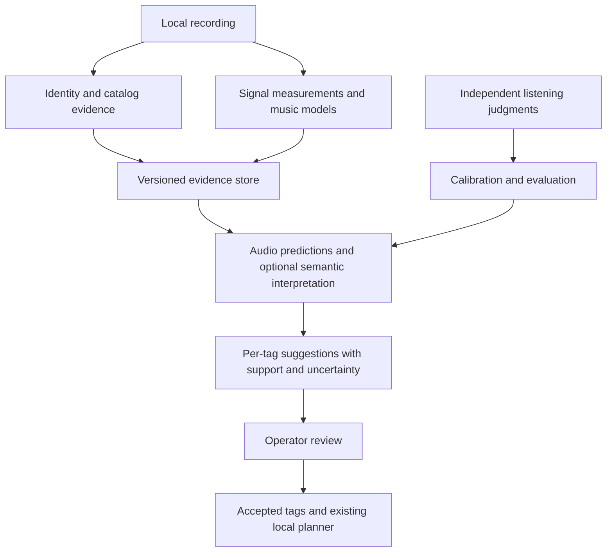

# Song evidence, audio analysis, and mood dataset research

Research date: 23 September 2026. Repository baseline: `3a68034`.
This is a research proposal, not an adopted runtime contract or model certification.
Source inspection and public documentation support the findings below. No private
library, listening labels, model weights, paid inference, or production service was
used. Expected quality gains require the experiments described here.

The follow-up [implementation plan](SONG_EVIDENCE_IMPLEMENTATION_PLAN.md) specifies
components, code owners, dependencies and completion gates.

## Recommendation

The largest opportunity is to improve what the system knows about the music before
asking a model to assign tags. The present execution, provenance, and review
boundaries are useful. The missing capability is a reusable song evidence dataset
that joins identified catalog facts, musical predictions from audio, temporal
development, and independently collected listening judgments.

| Question | Appropriate evidence | Result |
|---|---|---|
| What recording is this? | Identifiers, fingerprints, duration, recording/release/work relationships | Identity match, alternatives, provenance |
| What is audible? | Measurements and specialized audio models | Musical descriptors and measurements, including time ranges |
| What emotion does it convey? | Listening judgments and calibrated audio predictions | Multiple perceived moods, with uncertainty |
| Where would I use it? | Musical evidence, explicit context, operator preferences | Reviewable suitability for exploration, a tavern, or another session use |

"All verified data" should mean all relevant, attributable evidence whose identity,
scope, and permitted use are known. A verified catalog identity does not verify a
community mood label. An artist-level genre does not describe every recording.
A model score remains a prediction even from a reputable provider.

First compare an established audio classifier stack, a music-trained audio/text
embedding model, and the existing pipeline. Jev is a promising interpreter of
prepared evidence. It cannot replace audio analysis: its current specification
accepts text only. [TypeSafe model specification](https://docs.typesafe.ai/models).

## Current implementation: confirmed limits

The application already analyzes the whole recording, retains trajectories and up
to ten acoustic sections, optionally runs voice detection, bounds model inputs,
and requires review before changing manual tags. Relevant owners are
[context extraction](../crates/music-analysis/src/context.rs),
[voice inference](../crates/music-analysis/src/voice.rs),
[tagging](../crates/music-application/src/assistant/model_tagger.rs), and the
[Assistant contract](ASSISTANT_ARCHITECTURE.md).

These are code-level findings. Their prevalence and practical impact on the user's
library have not been measured.

| Finding | Current evidence | Consequence and priority |
|---|---|---|
| Narrow musical evidence | `model_tag_track_input` includes artist, album, origin, genre, duration, BPM, and compact DSP/voice context. No learned mood, instrument, harmonic, or music/text embedding input. | **P0:** text reasoning cannot reliably reconstruct musical information that was never supplied. |
| Different classification tasks share one vocabulary | The default has 49 settings, 8 periods, 42 scenes, and 39 moods: 138 entries. The prompt requires semantic support for settings, scenes, periods, and nuanced emotions. | **P0:** sparse metadata can correctly produce few tags despite complete analysis. Separate perceived mood from editorial suitability. |
| Intensity is gain-sensitive | `timeline_frames`: `0.50*loudness + 0.30*rhythmic_drive + 0.20*density`; loudness maps RMS from -50 to -10 dBFS. | **P1:** a +6 dB gain change contributes +0.075 to intensity inside the unclipped range. This is a signal proxy, not learned musical energy. |
| Coarse tempo candidates | `tempo_curve` uses 20 level samples/second. `estimate_tempo` selects an integer lag within 40–200 BPM with a prior centered on 120. Output is `1200 / lag`, without sub-lag refinement. | **P1:** adjacent candidates near 120 are 109.09, 120, and 133.33 BPM. A median can interpolate a summary, but individual estimates cannot resolve intermediate tempi. Decimal formatting does not establish accuracy. |
| Reliability is mostly heuristic | Six signal metrics receive fixed `medium` reliability; overall confidence depends on duration and active fraction. | **P1:** this measures coverage/engineering heuristics, not empirical feature error or mood calibration. |
| Structure follows proxy changes | Boundaries use intensity, drive, brightness, density, and spectral flux, with ten-second minimum spacing and at most ten sections. | **P1:** useful acoustic change detection does not establish harmony, verses, narrative sections, or every short climax. |
| Learned voice analysis is narrow | The MusiCNN worker selects two outputs and summarizes windows into normalized voice score and coverage. | **P1:** this is not an emotion/instrument/scene detector. Vocal passage timing is also lost in the tagger projection. |
| Catalog and acoustic interpretation are separate | Last.fm tags map by exact names/aliases into catalog suggestions; the mood model has no source-attributed catalog observation collection. Accepted genre edits can influence indexed metadata indirectly. | **P1:** jointly assess original source observations without feeding generated suggestions back as evidence. |
| Confidence is track-wide | `ModelTagTrackOutput` contains a tag list, one confidence value, and one evidence list. | **P1:** support for an individual tag cannot be distinguished. Add per-tag support, contradictions, and calibration identity. |
| Listening split permits related-track leakage | `createCohort` hashes 30 IDs into 20 development and 10 holdout tracks, without artist/album/recording-family grouping. | **P0 for evaluation:** related songs can cross the split. The initial pilot is a smoke test, not a sufficient model-selection dataset. |
| Audio cache identity includes metadata-sensitive file facts | `context_source_signature` includes analyzer, path, size, mtime, and voice identity. | **P2:** renames/tag rewrites can trigger reanalysis of unchanged audio. Separate audio-content, metadata, model, and vocabulary identities. This is a reuse limitation, not proof of a stale-write defect. |

The prompt already warns about gain sensitivity, correlated features, half/double
tempo, and uncalibrated voice scores. These warnings do not repair the evidence.
The [63-scenario suite](../crates/music-application/src/assistant/evaluation_suites/music-tagging-v1.json)
tests controlled semantic and safety behavior; the seven added acoustic cases are
synthetic. Passing it does not validate waveform-to-mood accuracy.

The eight-tag output cap is a design question, not a demonstrated bug. A concise
suggestion list can remain bounded while an evidence dataset retains more scores.
Measure whether the cap loses useful tags across the four groups before changing it.

## Reuse existing data through identity and provenance

Reuse the existing MusicBrainz, AcoustID, imported-observation, and Last.fm paths in
[catalog enrichment](../crates/music-application/src/cleanup_enrichment/workflow.rs).
Do not create a second recording matcher for mood tagging.

| Source | Contribution | Appropriate interpretation |
|---|---|---|
| Embedded identifiers and operator records | Recording/release identifiers and authored facts | Observations with conflicts retained; embedded values can still be wrong. |
| MusicBrainz | Recording, release, work, artist, credit, relationship data | Identity and attributable context; release facts stay separate from recording and composition. [API](https://musicbrainz.org/doc/MusicBrainz_API) |
| AcoustID/Chromaprint | Fingerprint-to-recording candidates | Corroborate identity and retain ambiguity. A fingerprint is not an emotion embedding. [Service](https://acoustid.org/webservice) |
| Last.fm | Community track tags | Weak semantic evidence for a matched recording. Counts are not calibrated mood probabilities; absent tags are not negative labels. [Track tags](https://www.last.fm/api/show/track.getTopTags) |
| Discogs | Edition, credits, genre, and style | Optional coverage expansion; release-level style cannot establish every track's mood. [Source scope](https://support.discogs.com/hc/en-us/articles/360003622014-How-To-Browse-Search-In-The-Database), [styles](https://support.discogs.com/hc/en-us/articles/360005055213-Database-Guidelines-9-Genres-Styles) |
| Sourced Wikidata and official composer/publisher notes | Work associations, instrumentation credits, explicit original-use descriptions | Preserve the reference and exact subject. A soundtrack relationship is context, not uniform emotional content. [References](https://www.wikidata.org/wiki/Help:Sources) |
| Human listening and use feedback | Perceived mood, useful applications, counterexamples | Most relevant evaluation evidence here; record who judged it, what was heard, and whether suggestions were visible. |

Distinguish local asset → recording/version → release occurrence → composition.
Covers, remixes, live performances, extended edits, and original cues can share
names while sounding different. Recording identity does not resolve album edition.
Preserve the separation established in [metadata research](LIBRARY_METADATA_RESEARCH.md).

Keep titles and filenames within identity resolution. Their usefulness in matching
does not justify restoring them as mood evidence. The title-free mood disclosure
remains the default; broader catalog facts need a versioned projection/disclosure.

Each observation needs subject identity, source/reference, original and normalized
value, retrieval time/revision, identity-match status, human/generated origin, and
rights/use policy. Track copied or derived sources: three sites repeating one
annotation are not three independent votes. Identity confidence, source reputation,
and claim-level reliability are separate properties.

Collection access, audio rights, annotation reuse, model weights, and permission
to train on API outputs are separate questions. MusicBrainz distinguishes CC0 core
data from differently licensed supplementary data. Dataset or code access does not
automatically grant every use of its music.
[MusicBrainz licensing](https://musicbrainz.org/doc/About/Data_License).

Historical AcousticBrainz outputs should remain attributed legacy predictions.
The project's retirement announcement itself raises concerns about the accuracy
represented by its data; they are unsuitable as unquestioned new ground truth.
[MetaBrainz announcement](https://musicbrainz.wordpress.com/2022/02/16/acousticbrainz-making-a-hard-decision-to-end-the-project/).

Spotify audio features are also a poor foundation for a new reusable dataset.
The endpoint is marked deprecated, and its current documentation restricts using
Spotify content with machine-learning/AI models. Do not assume an old exported
feature dataset is available for the proposed training or model-input use.
[Current endpoint and policy note](https://developer.spotify.com/documentation/web-api/reference/get-audio-features).

## Improve the audio evidence

Retain technical measurements and trajectories. Add learned representations and
small task-specific classifiers so the system can estimate instrument families,
vocal character, broad styles, arousal, valence, and mood descriptors. These remain
predictions with explicit model and preprocessing identities.

Improve tempo using beat-event timing and alternative pulse hypotheses. Distinguish
no stable pulse, weak pulse, and failed analysis. Investigate chroma/HPCP, tonal
stability, harmonic change, and roughness/dissonance as complementary evidence.
Do not map minor key directly to sadness or major key to happiness. Each feature
must improve held-out performance rather than merely increase the feature count.

Keep absolute loudness for technical inspection. For mood, compare gain-resistant
descriptors and relative within-track dynamics. Retain original levels alongside
any normalized analysis view; preserve crescendos and never modify source audio.
Each model's preprocessing must match its training assumptions.

### Candidate systems

"Established" means documented artifacts and tasks, not validated integration or
proven accuracy for this application.

| Candidate | Role and value | Adoption constraint |
|---|---|---|
| Essentia Discogs-EffNet + selected heads | Established baseline for reusable embeddings and mood/theme/instrument predictions. The existing pilot candidate emits 56 mood/theme scores from 1,280-dimensional embeddings. | Published PR-AUC 0.14 and ROC-AUC 0.76 are source-benchmark metrics, not 76% accuracy here. Requires its matching encoder, not current voice scores. [Exact artifact](https://essentia.upf.edu/models/classification-heads/mtg_jamendo_moodtheme/mtg_jamendo_moodtheme-discogs-effnet-1.json) |
| Essentia DEAM + MSD-MusiCNN | Reproducible continuous valence/arousal baseline. | The head expects a 200-dimensional `msd-musicnn-1` representation. Sharing the MusiCNN name with the voice classifier does not prove interchangeable features or weights. [Exact artifact](https://essentia.upf.edu/models/classification-heads/deam/deam-msd-musicnn-2.json) |
| LAION `larger_clap_music` | Music/text similarity and embeddings; richer descriptors and new vocabulary without a trained head for every term. | Similarity is not a probability. Compare positive descriptions, confusable alternatives, and abstention instead of always selecting the closest label. Published checkpoint card: Apache-2.0. [Model card](https://huggingface.co/laion/larger_clap_music) |
| MuQ / MuQ-MuLan | More ambitious representation and music/text matching challenger. | Official releases list approximately 300M/700M parameters, 24 kHz input, and CC BY-NC 4.0 weights. Released-model training differs from the paper's larger setting. Measure resources and native compatibility. [Official repository](https://github.com/tencent-ailab/MuQ) |
| Beat This! | Specialized beat/downbeat estimates addressing the coarse tempo path. | Code/weights are published under MIT; Python/PyTorch reference code is not a ready Rust integration. Test rubato, ambient, orchestral, and no-beat material. [Implementation](https://github.com/CPJKU/beat_this) |
| All-In-One | Reference for metrical and functional structure analysis. | Uses source separation and Harmonix-trained models. Pop verse/chorus semantics and processing cost need evaluation on soundtracks. [Implementation](https://github.com/mir-aidj/all-in-one) |
| Cyanite | Optional managed benchmark with documented mood, instrument, movement, and temporal outputs. | Requires external audio upload and access arrangements. Its taxonomy and predictions need the same listening evaluation. [Outputs](https://docs.cyanite.ai/docs/guides/model-outputs/), [upload workflow](https://docs.cyanite.ai/docs/intro/) |

Essentia distinguishes compatible encoders and heads; MTG-created weights are
CC BY-NC-SA 4.0 with proprietary licensing available. Some artifacts offer ONNX
exports. Check exact graphs, tensors, sample rates, preprocessing, and memory
rather than assuming that every head shares one encoder.
[Official catalog](https://essentia.upf.edu/models.html).

Keep the first comparison finite: the established stack and music CLAP, with
MuQ-MuLan as a larger challenger for a demonstrated gap. Consider MAEST or other
encoders only for a specific remaining failure or deployment tradeoff. MAEB's
2026 study found substantial task-dependent differences among audio encoders;
model size or a broad leaderboard does not choose the best mood representation.
[MAEB paper](https://arxiv.org/abs/2602.16008).

### Preserve time and disagreements

Analyze bounded overlapping windows throughout the recording using each model's
input requirements. Record timestamps and actual coverage. Start with fixed
windows, then test adaptive windows around significant changes. A sampled excerpt
must not silently become an observation about the whole track.

Retain window predictions locally, with duration-weighted summaries, variation,
opening/ending behavior, and contradictory passages. A calm average does not imply
suitability for quiet dialogue if a short climax interrupts it. One high-scoring
window likewise should not label an entire ten-minute track aggressive. Evaluate
aggregation against the intended use and retain enough detail to revise it later.

Separate speech, singing, choir, and instrumental evidence where supported.
Lyrics can provide a separate semantic view under an appropriate source policy;
speech recognition is not assumed reliable on singing. Lyrics can conflict with
the emotional sound. Use transcription or source separation for demonstrated
failures instead of making them mandatory for every recording.

## Build three datasets with different authority

### 1. Song evidence store

A proposed versioned observation schema, distinct from training labels:

| Record | Minimum contents |
|---|---|
| Asset/identity | Local ID, file and audio-content identities, recording/version/release/work links, match alternatives |
| Observation | Source/reference, subject, original/normalized value, time scope, observed/inferred status, revision, rights |
| Analysis run | Model/weight hash, runtime/preprocessing version, input identity, sample/channel policy, coverage/status, elapsed time, peak memory |
| Segment | Start/end, descriptors, raw scores/logits, embedding reference, uncertainty/missingness, analysis-run reference |
| Interpretation | Vocabulary/tag identity, per-tag result, supporting/opposing observation IDs, calibration version, temporal scope |
| Human judgment | Annotator, target definition, positive/negative/uncertain/unjudged, time scope, blind/assisted judgment, preference context |
| Dataset snapshot | Included versions, duplicate groups, partitions, exclusions, label provenance, manifest checksum |

Keep raw scores separate from calibrated estimates. Unavailable, not configured,
failed, and not applicable require explicit states. Missing voice does not mean
instrumental; missing tempo does not mean slow; missing tags do not mean negative.

Use exact byte/decoded-audio identities for cache correctness and robust acoustic
fingerprints for near-duplicate grouping. A fingerprint match is not permission to
reuse every measurement across a remaster or edit. Record the canonical decoding
policy, and keep related variants together in evaluation even when they need
separate audio analysis.

SQLite can own records and manifests initially, with large embedding arrays in
immutable local artifacts. Add a vector index when retrieval scale warrants it.
These data relationships do not require a distributed graph or vector database.

### 2. External reference datasets

These support pretraining, reproducible comparisons, and tests of specific
abilities. They do not automatically annotate the user's recordings. Transferring
an observation requires a checked recording/version match and preserved excerpt
scope, rights, and reliability.

| Dataset | Contribution | Limitation |
|---|---|---|
| MTG-Jamendo | Over 55,000 tracks with genre/instrument/mood-theme annotations. | Tags originate from uploaders. The raw mood subset has 59 tags; published splits retain 56. Weak annotations, not exhaustive listening truth. [Dataset](https://github.com/MTG/mtg-jamendo-dataset) |
| DEAM | 1,802 excerpts/full songs, continuous and whole-track valence/arousal. | Temporal affect, not tabletop labels. Preserve scales, timing, and scope. [Dataset](https://cvml.unige.ch/databases/DEAM/) |
| MusAV | Pairwise arousal/valence judgments across diverse genres. | Useful for comparative ranking; preview access and scope need checking. [Dataset](https://mtg.github.io/musav-dataset/) |
| EMOPIA | Human-labeled emotion in pop piano clips, with audio and MIDI. | Instrumental/piano check, not proof of orchestral or ambient performance. [Paper](https://arxiv.org/abs/2108.01374) |
| OpenMIC-2018 | Human instrument annotations, including individual responses. | Tests supporting traits rather than mood. Preserve annotation masks and uncertainty. [Dataset](https://github.com/cosmir/openmic-2018) |
| MusicCaps | 5,521 ten-second examples with musician-written captions/aspects. | Useful for grounded description. Text/IDs do not establish all audio rights or continued audio availability. [Card](https://huggingface.co/datasets/google/MusicCaps) |
| Song Describer | Human captions for 706 recordings, including a validated subset. | Intended for evaluation; creators discourage training. Derived from Jamendo split-0 test audio, so account for overlap. [Data card](https://github.com/mulab-mir/song-describer-dataset/blob/main/docs/datacard.md), [datasheet](https://github.com/mulab-mir/song-describer-dataset/blob/main/docs/datasheet.md) |
| Memo2496, exploratory | Paper reports 2,496 instrumental tracks with specialist annotations. | Verify downloadable artifacts, rights, protocol, and overlap before inclusion; paper claims alone do not establish readiness. [Paper](https://arxiv.org/abs/2512.13998) |

Do not silently pool different scales, label meanings, or audio scopes. Preserve
dataset identity and test leave-one-dataset-out generalization. A study across
five emotion datasets found substantial genre/distribution effects and reported
benefits from diverse data and harmonic information. This supports testing
complementary evidence, not assuming any mood head generalizes to cinematic music.
[Cross-dataset study](https://arxiv.org/abs/2510.04688).

### 3. Private listening benchmark and learning set

Keep the existing [30-track pilot](MOOD_PILOT.md) as a first check. If promising,
create a separate larger cohort. A proposed initial budget is 300–500 distinct
recordings, expanded according to per-tag evidence; this does not guarantee
statistical sufficiency. Many of 138 labels would still have few examples.

Sample soundtrack families, composers/artists, genres, vocal states, mastering
levels, durations, changing sections, and metadata richness. Include ambient/no-beat,
solo instruments, orchestral swells, electronic cues, effects, silence, live audio,
confusable cases, and tracks for which no available tag is appropriate.

Collect perceived emotion without titles, album/artist names, or model results.
Collect session suitability separately with the intended use clearly stated.
Define positive, negative, uncertain, and unjudged. Identify relevant passages on
changing tracks. Give annotators positive/counterexample anchors for terms such as
tense, mysterious, and heroic; use pairwise comparisons when absolute ratings are hard.

Use multiple independent listeners on a meaningful subset, especially ambiguous
cases. Preserve disagreement. If only the owner labels, describe the result as an
owner-preference benchmark. Record whether every candidate tag was judged: an
incomplete free-form list must not make every omitted tag a negative example.

Split by recording/duplicate family before fitting models. Keep versions, excerpts,
remasters, and crops together. Add album/artist separation and a distinct unseen-
composer or unseen-franchise challenge set. Group constraints can produce uneven
partitions; document compromises rather than claiming random splits are equivalent.

Use separate training/development, calibration, and locked test partitions. Tune
thresholds and prompts without test labels. Freeze vocabulary, retrieval examples,
and manifests before the final comparison. Audit known external-dataset overlaps;
unknown pretraining inventories remain an explicit uncertainty.

Keep synthetic safety/schema tests. Real listening measures a different property.
Music-QA research has shown that text-only shortcuts inflate apparent listening
performance; include metadata-only, no-audio, and shuffled-audio controls where useful.
[Perceptual benchmark study](https://arxiv.org/abs/2504.00369).

## Combine evidence without double-counting it

Proposed architecture; it does not change current permissions:

Prefer late combination: sources produce well-defined observations or scores,
then a small, testable layer combines them. Compare a regularized per-tag classifier
on frozen audio features with text-model interpretation. A local classifier may
prove better and cheaper for common moods; text models are useful for operator
vocabulary and semantic context beyond fixed public taxonomies.

Fit/calibrate using independent labels, including source quality and missingness.
Do not average CLAP similarity, Last.fm count, classifier sigmoid, and Jev
probability as if they shared a scale. Loudness/intensity and heads sharing an
encoder are correlated evidence. If base models were trained on the same labels,
train a combination layer with out-of-fold base predictions to avoid an
unrealistically easy training problem.

Separate audible traits, perceived affect, and session suitability. A song can
have sad lyrics, energetic instrumentation, and useful pursuit pacing. Preserve
these views rather than forcing one overall emotion. Each suggested tag needs
supporting observations, significant contradictions, scope, and calibration version.
Allow no tags; confidence is meaningful only where held-out evidence supports it.

A more ambitious stage can retrieve independently reviewed examples by audio
similarity, learning which similarities matter for the operator's labels. Restrict
examples to the training partition during evaluation. Do not propagate an entire
album's tags or let a previous generated annotation corroborate itself.

## Jev: useful role and specific limitations

TypeSafe currently lists `jev-1.13.0`, text-only inputs, and no customer fine-tuning/
LoRA. Pin the version for evaluation. Its `state` plus typed-question interface
needs a dedicated adapter; it is not the existing generated-JSON chat contract.
[Models](https://docs.typesafe.ai/models),
[interface](https://docs.typesafe.ai/introduction).

Recommended experiments:

1. **Per-tag support:** one Noul per non-exclusive tag, including its definition
   and positive/negative criteria. Evaluate all required tags without forcing one
   winner. Ask evidence sufficiency separately.
2. **Exclusive fields:** Choice for genuinely exclusive decisions, such as the
   current period group, with explicit unknown and cross-era options.
3. **Review help:** Score a defined suitability rubric or select supporting
   observations from supplied candidates. A rubric score is not tag probability.

Noul returns a yes-probability without a separate confidence field. Choice/Score
return distributions and a confidence statistic derived from them. A concentrated
distribution or a number in 0–1 does not establish calibration on this collection.
Noul 0.8 does not mean "80% energetic"; thresholds do not transfer automatically
between question types.
[Noul](https://docs.typesafe.ai/primitives/noul),
[Choice](https://docs.typesafe.ai/primitives/choice),
[confidence](https://docs.typesafe.ai/confidence).

Send compact, named musical observations with source quality, scope, uncertainty,
and relevant catalog claims. Keep arithmetic, aggregation, thresholds, timestamps,
and consistency rules in Rust. TypeSafe documents weaknesses in numeric precision,
indirection, irrelevant long state, and adversarial content. Independent answers
also need not obey cross-question probability identities. Enforce exclusivity and
consistency locally. [Limitations](https://docs.typesafe.ai/model-jaggedness/jev-1.13).

Question IDs are not sent to the model according to the Noul documentation. Put
tag meanings in instructions/criteria, not only keys such as `mood_melancholic`.
Questions run independently against the same state; dependent stages require
explicit orchestration, not an assumed hidden chain.
[Request structure](https://docs.typesafe.ai/primitives/noul),
[execution](https://docs.typesafe.ai/introduction).

Jev does not generate the evidence strings required by today's tagger. An adapter
could select supplied evidence IDs and have the application render a clearly
identified explanation. This requires a versioned contract, strict validation,
and quality checks, without fabricating a model explanation or weakening the parser.

Schema correctness is separate from semantic accuracy. The vendor's launch
workflow comparisons use reference probabilities from other models; they do not
establish independent music-label accuracy. Jev is a benchmark candidate, not a
verifier whose decisions become ground truth.
[Vendor methodology](https://typesafe.ai/blog/introducing-system-one-models-and-jev).

## Experiments and acceptance evidence

Use the same fixed tracks and vocabulary. Predeclare development budgets and
retain all runs, including empty outputs and failures.

| Experiment | Question answered |
|---|---|
| Current DSP/metadata + current tagger | Actual baseline, especially sparse metadata |
| Verified metadata alone, audio evidence alone, both | Independent source value and metadata shortcut effects |
| Existing DSP versus better tempo/harmonic features | Whether added measurements improve useful tags |
| Established pretrained heads versus music CLAP | Fixed-taxonomy predictions versus flexible audio/text matching |
| Frozen embeddings + small local classifier | Whether common moods need a remote semantic model |
| Same prepared evidence → current text model versus Jev | Interpreter effect on precision, coverage, calibration, latency, cost |
| Whole-track pooling versus temporal aggregation | Importance of changes, endings, and vocal entrances |
| Combined system with each source removed in turn | Whether complexity contributes independent value |
| Gain, encoding, missing metadata, contradictory-source controls | Whether decisions follow music rather than recording level or catalog shortcuts |

Measure per-tag/per-group precision, recall, PR-AUC, macro/micro averages,
abstention/coverage, negative-example false positives, and sparse-metadata/unseen-
family performance. Report judgment counts and uncertainty intervals. Eight correct
predictions out of ten are not strong evidence of general 80% precision.

For probabilistic outputs, use Brier score and reliability plots where complete,
well-defined judgments support them. Separate listener disagreement from model
uncertainty. For continuous affect, measure error, correlation, and pairwise ranking;
these are not categorical accuracy. For retrieval, measure usefulness at the
actual displayed list size and ranking quality.

Preserve existing synthetic safety thresholds. The pilot's 80% useful-tag precision
and 60% supported-track coverage targets remain initial goals, not universal
certification. Choose tag-specific thresholds on calibration data; assess them on
untouched recordings. Rare labels can remain uncertified and explicitly reviewable.

Measure operational cost too: time and peak memory per minute of music, projected
library cost from measured samples, cache reuse, failures, correction calls, and
review minutes per useful accepted tag. Measure incremental benefit per source.

## Phased implementation proposal

| Phase | Work | Completion criterion |
|---|---|---|
| 0: Targets and evaluation | Define labels, separate mood/use/context, independently judge the initial pilot, design grouped larger partitions. | Reproducible baseline, explicit unknowns, no test tuning or related-track leakage. |
| 1: Reusable evidence | Reuse catalog identity, preserve source observations, add typed manifests and audio-content identity separate from metadata/vocabulary. | Attributable claims; unchanged audio reused; source-policy changes invalidate dependent decisions. |
| 2: Audio comparison | Test exact Essentia encoder/heads and music CLAP; measure tempo, resources, temporal behavior, and labels. Add MuQ-MuLan for a remaining gap. | Demonstrated winner or rejection; native outputs match reference preprocessing/inference within declared tolerances. |
| 3: Decision comparison | Fit a small local baseline, combine sources, benchmark Jev, add per-tag provenance/calibration. | Better held-out usefulness at measured cost; abstention, missing-source behavior, and safety preserved. |
| 4: Learn and expand | Sample corrections, disagreements, rare labels; retain random audits and locked tests. | Demonstrated generalization without recycling generated suggestions into supposed ground truth. |

Preserve the Rust runtime boundary. Reference code can inform offline experiments;
production adoption requires compatible native inference or a separately approved
external analyzer contract. Existing `tract-tensorflow` voice support does not prove
arbitrary TensorFlow/ONNX compatibility. Do not incidentally add a Python production
service.

Audio identity + model/preprocessing should identify expensive reusable features;
metadata/vocabulary/calibration should identify later interpretations. Share a
bounded decode pipeline where practical, but resample from suitable original-
quality input for each model. Upsampling the present 16 kHz stream cannot restore
higher frequencies.

Preserve disclosures, credential handling, checkpoints, cancellation, provenance,
and explicit review. Learned musical predictions belong in a separate versioned
evidence contract, not silently classified as factual `local-context/v2` outputs.
No playback or Baton protocol change is needed for this research; future wire
changes follow the existing cross-client requirements.

Complex extensions should address measured gaps: active learning over recording
groups, metric learning from reviewed similar/dissimilar pairs, partial-label
learning for community annotations, domain-specific calibration, and teacher/student
distillation where source terms allow it. Preserve human/generated distinctions
and test each addition against the simpler system. The durable asset is the
independently judged, versioned evidence dataset, allowing future models to be
replaced without rebuilding the library's knowledge.
